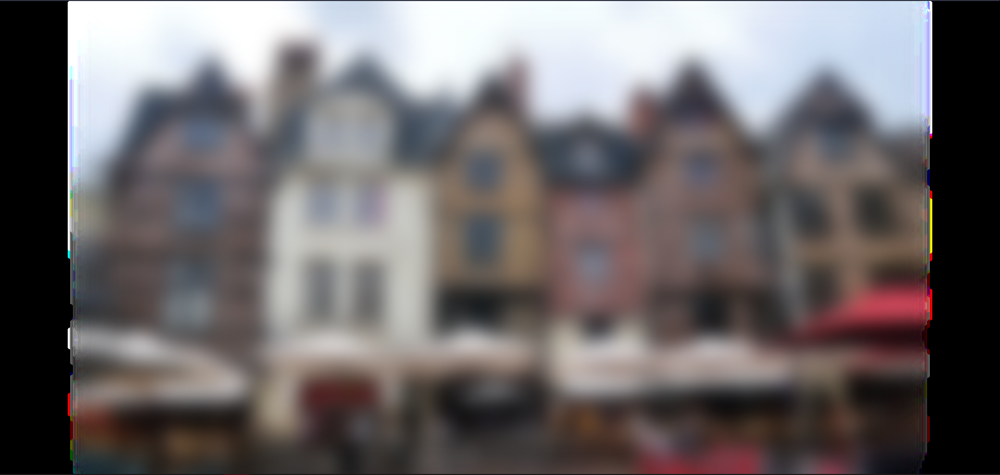

This is a [Next.js](https://nextjs.org/) project bootstrapped with [`create-next-app`](https://github.com/vercel/next.js/tree/canary/packages/create-next-app).

## Getting Started

First, run the development server:

```bash
yarn dev
```

Open [http://localhost:3000](http://localhost:3000) with your browser to see the result.

# The issue

- ### The blur base64
    - 
- ### The SVG using the blur base64
    - 


As we can see in the `src/blur.svg` the viewBox have weird values

```SVG
<svg xmlns='http://www.w3.org/2000/svg' viewBox='0 0 undefined undefined'>
    <filter id='b' color-interpolation-filters='sRGB'>
        <feGaussianBlur stdDeviation='20'/>
        <feComponentTransfer>
            <feFuncA type='discrete' tableValues='1 1'/>
        </feComponentTransfer>
    </filter>
    <image filter='url(#b)' x='0' y='0' height='100%' width='100%' href='data:image/jpeg;base64[...]'/>
</svg>
```

So the svg have this weird artifacts and the black borders